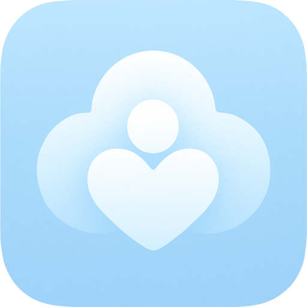

<div align="center">
  
  
# **The Reyes Vault**
  
  **A digital vault for preserving family memories. Forever, searchable, and safe in the cloud.**
</div>

This project is a full-stack Next.js application aimed at creating a secure and user-friendly platform for uploading, viewing, organizing, and searching digitized family memories like photos, videos, and audio recordings.

## 🚀 MVP Progress: 23%

[](https://github.com/jameslreyes/the-reyes-vault/blob/main/PLAN.md)

I am currently in the early stages of development, focusing on core infrastructure, user authentication, and basic application setup.

**Completed Milestones:**

- Project Initialization & Core Infrastructure (Next.js, Supabase, Cloudflare R2, Vercel integration)
- User Authentication & Authorization (Sign-in, Sign-out, Protected Routes, Basic Session Management)

**Next Up:**

- Defining User Roles (Admin/User)
- Admin User Management UI & Functionality
- Core Memory Upload & Viewing Features

For a detailed breakdown, see the [PLAN.md](PLAN.md).

## ✨ Core MVP Features (Goals)

- **User Accounts:** Secure login for authorized users.
- **Admin User Management:** Admin interface for CRUD operations on users.
- **Memory Upload:** Support for photos, videos, and audio files.
- **Memory Viewing:** Chronological stream of memories with basic filtering.
- **Metadata Entry:** Add/edit titles, dates, descriptions, tags, and people involved.
- **Organization:** Create "Albums" or "Events" to group memories.
- **Search:** Search memories by various metadata fields.

## 🛠️ Technology Stack

- **Framework:** Next.js (App Router, Full-Stack)
- **Language:** TypeScript
- **UI Library:** shadcn/ui
- **Styling:** Tailwind CSS
- **Database:** PostgreSQL (via Supabase)
- **Authentication:** Supabase Auth
- **File Storage:** Cloudflare R2
- **Hosting & CI/CD:** Vercel

## 🏁 Getting Started

To run this project locally:

1. **Clone the repository:**

   ```bash
   git clone https://github.com/jameslreyes/the-reyes-vault.git
   cd the-reyes-vault
   ```

2. **Install dependencies:**

   ```bash
   npm install
   # or
   # yarn install
   # or
   # pnpm install
   ```

3. **Set up environment variables:**

   - Create a `.env.local` file in the root of the project.
   - Add your Supabase project URL and anon key:

     ```env
     NEXT_PUBLIC_SUPABASE_URL=your_supabase_url
     NEXT_PUBLIC_SUPABASE_ANON_KEY=your_supabase_anon_key
     ```

   - You will also need to configure Cloudflare R2 credentials if you plan to work on file upload features.

4. **Run the development server:**

   ```bash
   npm run dev
   ```

   Open [http://localhost:3000](http://localhost:3000) with your browser to see the result.

## 🤝 Contributing

This is currently a personal learning project. However, suggestions and feedback are welcome! Please feel free to open an issue for bugs or feature ideas.

_This README will be updated as the project progresses._
